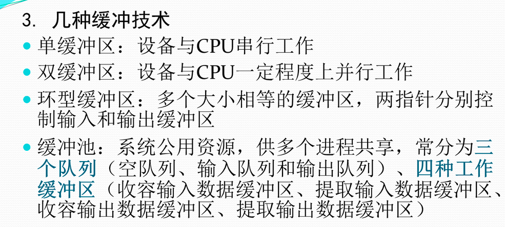

# 操作系统与网络 L3

### 分页管理

（接着上节课[L2](操作系统与网络 L2.md)）

#### 特点

- 只有最后一个块可能出现碎片（页内碎片），利用率高于分区管理。
- 作业一次装入内存，不能运行超过主存容量的大作业。

#### 存储保护

页号>页表长度时，产生**越界中断**。

### 分段管理

### 动态分页管理——虚拟页式存储管理

- **基本思想：内存划分为块，作业划分为页**，运行作业时不要求把全部程序和数据装入主存，只装入需要执行的几页，其余驻留在外村，需要时系统产生**缺页中断**信号，中断程序，调页程序将所需页面掉入。
- **程序局部性：时间局部性&空间局部性**
	- 时间局部性：指一旦某指令或数据被访问了，可能很快又要再次被访问（如循环变量）。
	- 空间局部性：指一旦某为止鹎访问了，附近的位置可能很快被访问（顺序结构，先行数据结构）
- **虚存**：把内存和外存结合起来使用，从而得到一个容量很大的“内存”

- 缺页中断与一般中断的区别：在指令执行期间产生和处理；一条指令在执行期间可能产生多次缺页中断
- 调页技术
	- 先进先出算法（FIFO）
	- 最近最久未使用算法（LRU）

- 特点：
	- 提供虚拟存储，可运行大作业
	- 缺页中断及页调度开销较大
	Note: 虚拟存储器的容量不是无限的，由计算机的地址结构（地址总线）确定。

- 影响缺页次数的因素
	1. 分配给进程的物理页面数
	2. 页面本身的大小
	3. **程序的编制方法**
	4. 页面淘汰算法

- 颠簸（抖动）：页面在内存与外存之间频繁调度，大量消耗系统时间和资源，甚至导致系统崩溃。可能原因：
	- 页面淘汰算法不合理
	- 分配的物理页面数太少

## 1.5 设备管理

### I/O 设备
- I/O性能常常成为系统性能的瓶颈。
- 种类多，结构各异，速度差异大。
- 与其他功能联系密切，尤其是文件系统

### 设备的分类：

#### 按操作特性：

- 存储设备：磁盘、磁带等
- I/O设备：向CPU传输信息和输出经加工处理的信息，如键盘、显示器等

#### 按信息交换单位：

- 块设备：处理信息的基本单位是字符块，块大小为512B～4GB，如磁盘、磁带等。
- 字符设备：处理信息的基本单位是字符，如键盘、打印机、显示器等

#### 按从属关系：

- 系统设备：操作系统生成时已经登记在系统中的标准设备，如键盘、显示器等
- 用户设备：操作系统生成时未登记在系统中的非标准设备，如鼠标、扫描仪等

#### 按共享属性：

- 独享设备：在一段时间内只允许一个进程访问的设备。多数地速I/O设备都属于独享设备，如打印机等。
- 共享设备：一段时间内允许多个进程同时访问的设备，如磁盘。
- 虚拟设备：通过虚拟技术将独享设备转换为若干台逻辑设备，供若干进程同时使用，通常把这种经过虚拟技术处理后的设备称为虚拟设备。

Note: 对于独享设备，如果计算机系统的作业管理不弄充分、连续地利用独享设备，独享设备的使用效率会非常低下甚至死锁！

### 设备管理的任务：

- 完成用户的I/O请求
- 按照一定算法分配I/O设备
- 提高I/O设备的利用率

### 中断技术

### 缓冲技术

**缓冲池**

USB技术：通用串行总线

## 课后习题整理

### 分页管理

- 虚拟存储器**最大容量由地址结构决定**，**实际容量由内外存之和决定 
**
- 在可变式分布存储中，拼接技术可以**集中空闲区**
- **实现虚拟存储的目的是扩充主存容量**
	- 内存（主存）直接给CPU提供存储，高速，低容量，价格贵，不能永久保存数据，断电消失，需要从辅存中重新调入数据。
	- 外存（辅存）给主存提供数据，低速，大容量，价格低，能永久保存数据。
- 把作业地址空间中使用的逻辑地址变成内存中物理地址称为**重定位**
- 动态重定位：是在**程序执行期间每次访问内存之前进行重定位**
- **注意页号和块号都是从零开始的！**所以`物理地址=块号*块大小＋页内地址`

### 设备管理

- 通道是一种**I/O处理机**
- 在操作系统中，用户在使用I/O设备时，通常采用**逻辑设备名**