```
# Generator
for i in {1..15}
do
	cat "操作系统与网络 L"$i".md" >> "操作系统与网络_总集.md"
	echo >> "操作系统与网络-总集.md"
done
```

# 操作系统与网络 L1

## 课程概述

教授邮箱 <wenyuan@nankai.edu.cn>

前三到四周：操作系统

第一部分：操作系统

 - 操作系统概述
 - 进程管理
 - 作业管理
 - 存储管理
 - 设备管理
 - 文件管理

第二部分：Unix/Linux 操作系统

- 基础知识及常用命令
- Shell 及程序设计
- Linux 下的 C++程序设计

第三部分：计算机网络

- 网络基本概念
- TCP/IP概述
- 套接口简介
- TCP套接字程序设计
- UDP套接字程序设计


## 1.1 操作系统概述

- 计算机系统的组成
- 计算机系统的层次结构
- 操作系统的主要功能
- 操作系统的分类
- 常见操作系统

### 计算机系统的组成

- 硬件系统（裸机）：CPU、存储器（主存、辅存）、I/O、I/O控制系统
- 软件系统：系统软件、应用软件
	- 系统软件：管理计算机本身的操作。如操作系统、编辑软件、编译软件等
	- 应用软件：提供给用户进行阶梯。如科学计算、事务管理等。

操作系统定义：直接控制、管理
计算机系统硬、软件全部资源，从而使系统能协调、高效、安全运行，并为用户提供方便、可靠的工作环境的系统软件。

### 操作系统的组成

 - 进程管理
 - 作业管理
 - 存储管理
 - 设备管理
 - 文件管理
 进程通信和网络通信是网络操作系统才有的子模块
 
 操作系统的功能：
 
 - 处理机管理：分配和控制处理器（进程和作业管理）
 - 存储器管理：内存的分配和回收
 - I/O设备管理：I/O设备的分配和操纵
 - 文件管理：负责文件的存取、共享和保护

 
操作系统的分类：

1. 单用户操作系统（同一个时刻只允许一个用户登录）
2. 批处理操作系统  
	并发：两个或多个事件在同一时间间隔内发生  
	并行：两个或多个时间在同一时刻发生（多CPU）  
	好处：提高了CPU、内存和I/O的利用率  
	特征：多通道、无序性、调度  性，且无交互能力
	多道程序设计：提高资源利用率
3. 分时操作系统
	把CPU划分为长短相同（或基本相同）的时间区间，称为“时间片”。通过中断控制，把这些时间片依次轮流分配给各个用户使用。而从用户角度看类似“独占”。  
	具有多路性、交互性、独占性、及时性等特点。  
4. 实时操作系统：在限定的时间范围内及时作出响应。具有及时响应、高可靠性、适用于专用系统等特点。
5. 网络操作系统
6. 分布式操作系统
# 操作系统与网络 L2

## 1.2 进程管理

### 主要内容

- 进程概念，进程与程序的区别
- 进程三种基本状态（运行态、等待态、就绪态）及其转换
- 进程存在的唯一标志PCB
- 进程调度方法
- 进程的互斥和同步
- 进程与线程的关系

视频？

### 概念

进程概念：具有独立功能的、可与其他程序并发执行的程序关于某个数据集合上的一次运行活动。是系统进行资源分配和调度的独立单位。

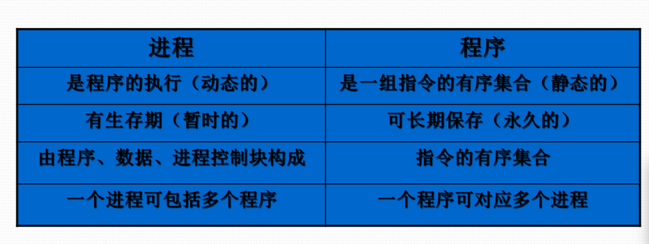

线程是调度的最小单位，不是资源分配的最小单位。进程是资源分配的最小单位。

进程三种基本状态及其转换：

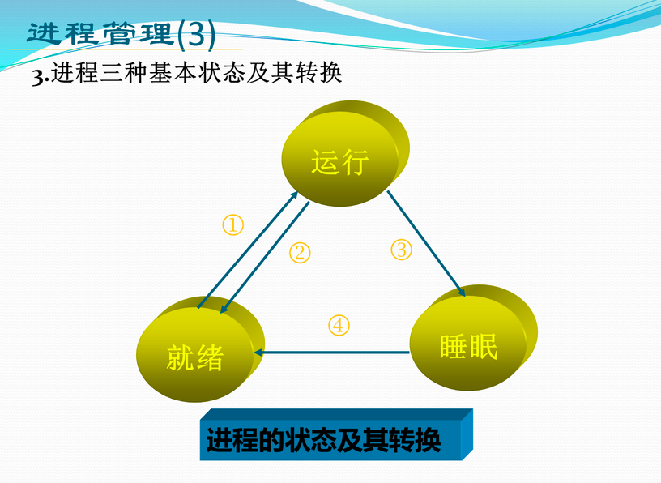

就绪态：已经分配到除CPU意外的所有必要资源，只等待使用CPU，一旦获得CPU便立即执行

### 进程控制块PCB：描述进程

是进程存在的唯一标志。

### 进程控制：原语操作

### 线程

 - 独立调度的基本单位。
 - 线程也有三态。
 - 线程可并发执行。
 - 多线程共享进程资源和空间。


### 进程调度

按照一定的算法把CPU分配给某一就绪进程，使其由就绪态转为运行态。

#### 进程调度算法：

- 非剥夺式优先算法
- 剥夺式优先算法（适用于实时系统）
- 剥夺与非剥夺式结合优先算法
- 时间片轮转法

**临界资源**：一次仅允许一个进程使用的资源，如打印机、磁带机、共享数据等

**临界区**：每个进程中访问临界资源等那段程序

多个并发进程访问临界资源时，存在竞争制约关系：

- **互斥**：多个进程互相排斥地使用临界资源。如磁带机使用、机票订购等问题。
- **同步**：指对多个进程在执行次序上的协调，这些进程相互合作，有事需要互相等待或互通消息（相互制约），如生产者-消费者问题。


## 1.3 作业管理

### 作业、作业步

- 作业：用户在外存一次算题过程或一次事物处理过程中，要求计算机系统所做工作的集合。作业包括用户程序、数据和控制作业的命令。
- 作业步：完成作业过程中所经历的各个阶段。作业步相互独立，又相互联系，且有顺序。
- 进程和作业：进程是一个程序在一个数据集上的一次执行，而作业是用户提交给系统的一个任务。用户提交作业后，当作业被调度，系统会为作业创建进程。

### 作业调度

按照某种策略从**后备作业队列**中选取一个或几个作业，为它们分配必要的资源，建立若干进程，然后由进程调度程序处理。每个作业有唯一作业控制块JCB。

### 常用作业调度算法

- 先来先服务调度算法FCFS
- 短作业优先调度算法SJF
- 响应比高者优先调度算法（$响应比=1+\frac{等待时间}{估计运行时间}=\frac{响应时间}{估计运行时间}$，对于长作业，随着等待时间加长，可以提高优先权。
- 优先数调度算法

**参考例题！**

### 作业调度算法的目标

- 单位时间内尽可能多的作业
- 使处理机尽可能保持忙碌
- 使各种I/O设备得以充分利用
- 对所有作业都是公平合理的

### 作业调度算法性能的衡量

- 平均周转时间（周转时间=完成时间-提交时间）
- 平均带权周转时间（带权周转时间=周转时间/运行时间，总是大于一）


## 1.4 内存管理Part1

### 存储器的层次结构


### 存储管理的目的

1. 主存的分配和管理：分配&释放
2. 提高主存的利用率：共享主存
3. “扩充”主存容量：为用户提供比主存物理空间大的多的地址空间；调入调出。
4. 存储保护：确保互不干扰，不破坏其他作业或系统文件的信息。

### 基本概念

1. 存储分配：为具体的程序和数据等分配存储单元或存储区工作。
2. 映射：把逻辑地址转换为相应的物理地址的过程。
3. 地址空间：程序用来访问信息所用地址单元的集合
4. 存储空间：主存中物理单元的集合
	- 逻辑地址与地址空间（逻辑空间）
	- 物理地址与存储空间（内存空间
5. 内存扩充：虚拟存储技术
6. 重定位：逻辑地址到物理地址到映射
	- 静态重定位：当用户程序被装入内存时，一次性实现逻辑地址到物理地址到转换，以后不再转换
动态重定位：在程序运行过程中要访问数据时再进行地址变换


### 存储管理方案
1. 实存储管理方案
	- 分区管理（固定分区分配和可变分区分配）
	- **分页管理**
	- 分段管理
2. 虚拟存储管理方案：作业程序空间大雨内存可用空间时
	- **动态分页管理**
	- 段页式管理


### 分页管理

- 分页：系统把用户程序按逻辑页划分为大小相等的部分，称为页或虚页。
- 块：内存按页的大小划分为大小相等的区域，称为内存块
- 内存分配：以页为单位进行分配，并按作业的页数多少来分配。逻辑上相邻的页，物理上不一定相邻。
- 页表：列出作业的逻辑地址与其在主存中的物理地址之间的对应关系
- 页面大小：大小适中，2的幂，通常为512B ~8KB 

- 地址结构：页号+页内位移量


## 课后习题整理

- **作业调度不需要分配CPU，进程调度需要分配CPU**
- 一个进程被唤醒意味着**进程状态变为就绪**
- 一个运行的进程用完了分配给它的时间片，其状态将变为**就绪**
- 进程和程序的本质区别是**动态和静态特征**
- 用户在一次计算过程中，或者一次事物处理中，要求计算机所做的工作集合，是指**作业**
- 处于后备状态的作业放在**外存**中
- 在操作系统中，作业处于**执行**时，已处于进程的管理之下。
- 当作业进入完成状态，操作系统将**将该作业的控制块从当前作业队列中删除，收回其所占资源，并输出结果**
- 作业调度算法的选择常常考虑的因素之一为使系统有最高的吞吐率，为此应**能够处理尽可能多的作业**

# 操作系统与网络 L3

### 分页管理

（接着上节课[L2](操作系统与网络 L2.md)）

#### 特点

- 只有最后一个块可能出现碎片（页内碎片），利用率高于分区管理。
- 作业一次装入内存，不能运行超过主存容量的大作业。

#### 存储保护

页号>页表长度时，产生**越界中断**。

### 分段管理

### 动态分页管理——虚拟页式存储管理

- **基本思想：内存划分为块，作业划分为页**，运行作业时不要求把全部程序和数据装入主存，只装入需要执行的几页，其余驻留在外村，需要时系统产生**缺页中断**信号，中断程序，调页程序将所需页面掉入。
- **程序局部性：时间局部性&空间局部性**
	- 时间局部性：指一旦某指令或数据被访问了，可能很快又要再次被访问（如循环变量）。
	- 空间局部性：指一旦某为止鹎访问了，附近的位置可能很快被访问（顺序结构，先行数据结构）
- **虚存**：把内存和外存结合起来使用，从而得到一个容量很大的“内存”

- 缺页中断与一般中断的区别：在指令执行期间产生和处理；一条指令在执行期间可能产生多次缺页中断
- 调页技术
	- 先进先出算法（FIFO）
	- 最近最久未使用算法（LRU）

- 特点：
	- 提供虚拟存储，可运行大作业
	- 缺页中断及页调度开销较大
	Note: 虚拟存储器的容量不是无限的，由计算机的地址结构（地址总线）确定。

- 影响缺页次数的因素
	1. 分配给进程的物理页面数
	2. 页面本身的大小
	3. **程序的编制方法**
	4. 页面淘汰算法

- 颠簸（抖动）：页面在内存与外存之间频繁调度，大量消耗系统时间和资源，甚至导致系统崩溃。可能原因：
	- 页面淘汰算法不合理
	- 分配的物理页面数太少


## 1.5 设备管理

### I/O 设备
- I/O性能常常成为系统性能的瓶颈。
- 种类多，结构各异，速度差异大。
- 与其他功能联系密切，尤其是文件系统

### 设备的分类：

#### 按操作特性：

- 存储设备：磁盘、磁带等
- I/O设备：向CPU传输信息和输出经加工处理的信息，如键盘、显示器等

#### 按信息交换单位：

- 块设备：处理信息的基本单位是字符块，块大小为512B～4GB，如磁盘、磁带等。
- 字符设备：处理信息的基本单位是字符，如键盘、打印机、显示器等

#### 按从属关系：

- 系统设备：操作系统生成时已经登记在系统中的标准设备，如键盘、显示器等
- 用户设备：操作系统生成时未登记在系统中的非标准设备，如鼠标、扫描仪等

#### 按共享属性：

- 独享设备：在一段时间内只允许一个进程访问的设备。多数地速I/O设备都属于独享设备，如打印机等。
- 共享设备：一段时间内允许多个进程同时访问的设备，如磁盘。
- 虚拟设备：通过虚拟技术将独享设备转换为若干台逻辑设备，供若干进程同时使用，通常把这种经过虚拟技术处理后的设备称为虚拟设备。

Note: 对于独享设备，如果计算机系统的作业管理不弄充分、连续地利用独享设备，独享设备的使用效率会非常低下甚至死锁！

### 设备管理的任务：

- 完成用户的I/O请求
- 按照一定算法分配I/O设备
- 提高I/O设备的利用率

### 中断技术

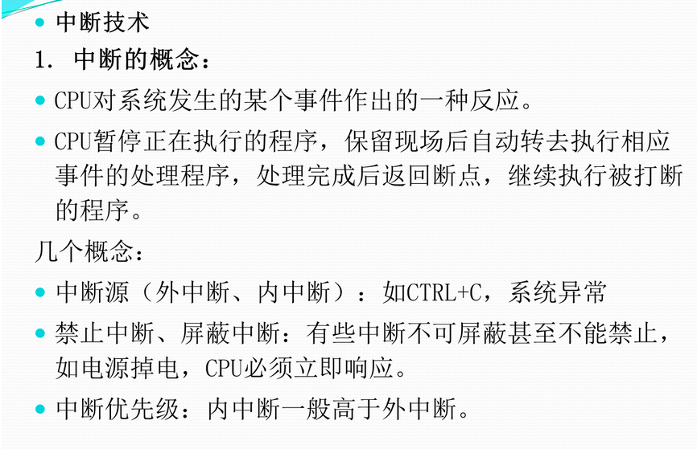

### 缓冲技术


**缓冲池**

USB技术：通用串行总线


## 课后习题整理

### 分页管理

- 虚拟存储器**最大容量由地址结构决定**，**实际容量由内外存之和决定 
**
- 在可变式分布存储中，拼接技术可以**集中空闲区**
- **实现虚拟存储的目的是扩充主存容量**
	- 内存（主存）直接给CPU提供存储，高速，低容量，价格贵，不能永久保存数据，断电消失，需要从辅存中重新调入数据。
	- 外存（辅存）给主存提供数据，低速，大容量，价格低，能永久保存数据。
- 把作业地址空间中使用的逻辑地址变成内存中物理地址称为**重定位**
- 动态重定位：是在**程序执行期间每次访问内存之前进行重定位**
- **注意页号和块号都是从零开始的！**所以`物理地址=块号*块大小＋页内地址`


### 设备管理

- 通道是一种**I/O处理机**
- 在操作系统中，用户在使用I/O设备时，通常采用**逻辑设备名**

# 操作系统与网络 L4

## 1.6 文件管理


Linux 下的文件权限管理：四组10位


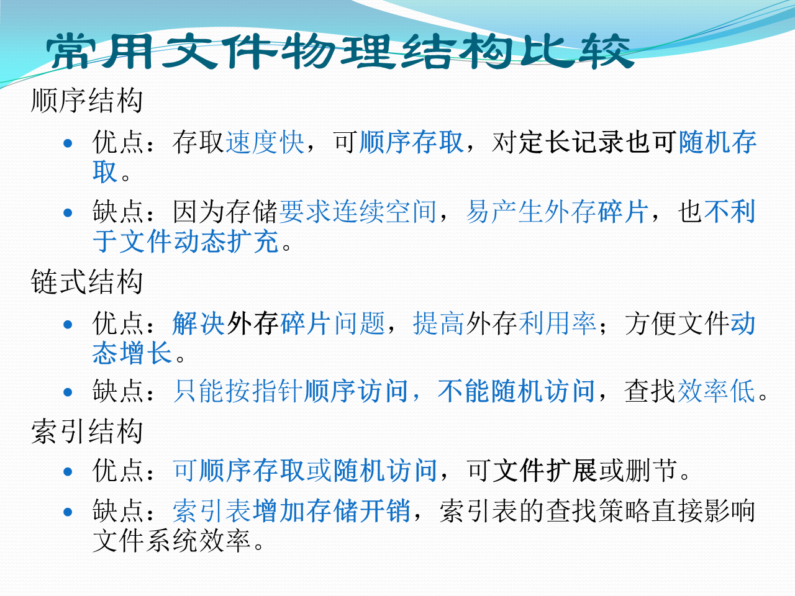


## 2.1 Linux 系统基础知识

vi/vim 编辑器的使用，略。

## 课后习题整理

### 文件管理

- 文件系统中用**目录**管理文件。
- 磁盘上的文件以**块**为单位读写。
	- 磁道划分为扇区，**扇区是磁盘最小的物理存储单元**，操作系统**将相邻的扇区组合在一起，形成一个块**，对块进行管理，块也叫簇
- 位示图可用于**磁盘空闲盘块的分配和回收，磁盘空间的管理**，无法用于文件目录的查找！
- **顺序结构不利于文件的动态增长**

# 操作系统与网络 L5

## 第二部分 Linux操作系统


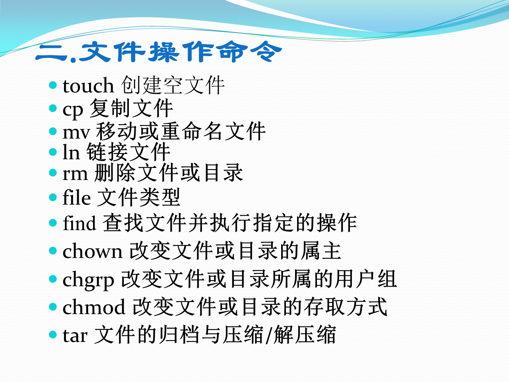

# 操作系统与网络 L6

## 第二部分 Linux操作系统


# 操作系统与网络 L7

## 第二部分 Linux操作系统

### 过滤器


# 操作系统与网络 L8

## 第二部分 Linux操作系统


**注意 `-e -r -w -x` 均可对文件夹使用，但`-f` 不可以！**

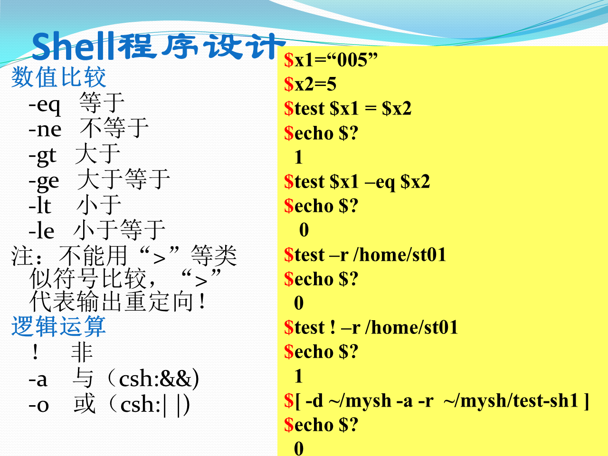


### if 语句

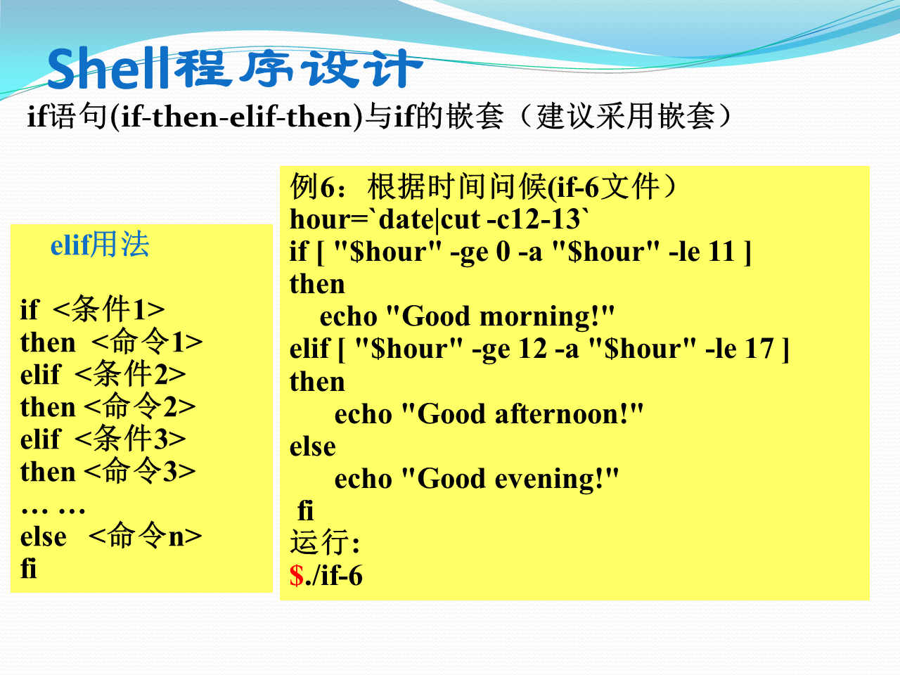

# 操作系统与网络 L9

## 第二部分 Linux操作系统

### case 语句


### for 循环

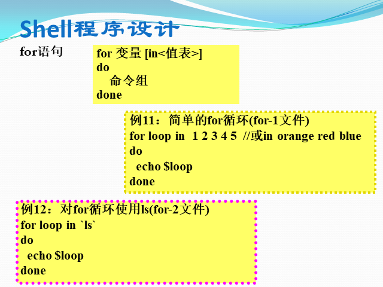
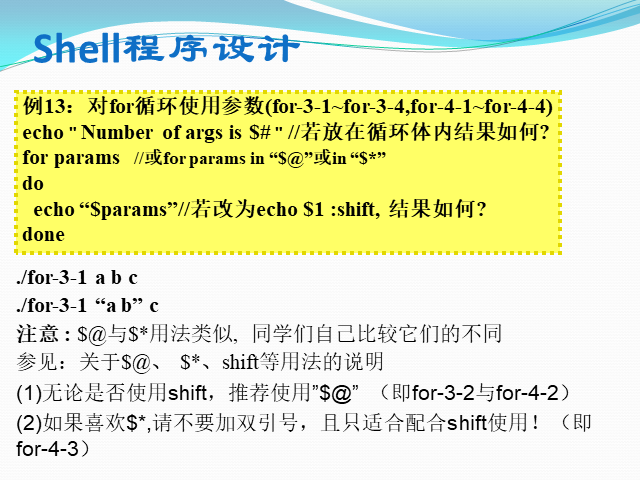


for file in *
for file in ./*
一样


### while 循环


### break continue exit retun 语句


# 操作系统与网络 L10

## 第二部分 Linux操作系统

### Shell 环境

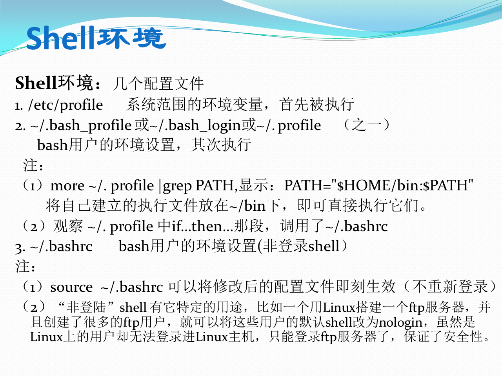


## Linux 下 C++ 程序设计


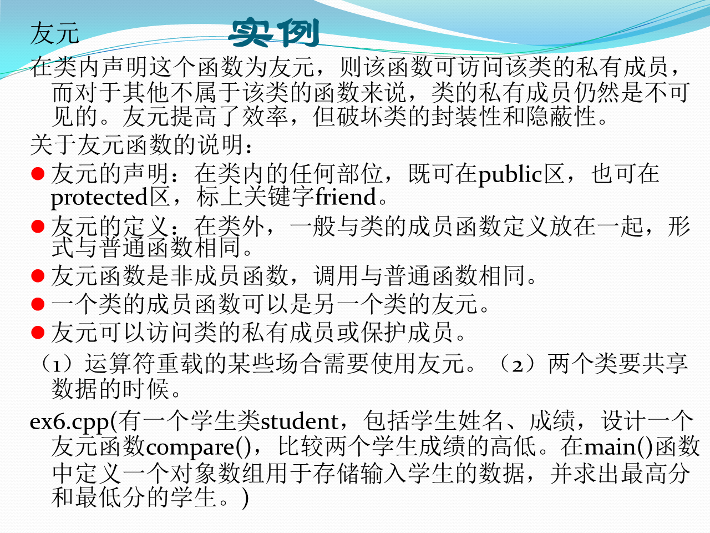


# 操作系统与网络 L11

## Linux 下 C++ 程序设计


## 网络基本概念


# 操作系统与网络 L12

## 网络基本概念

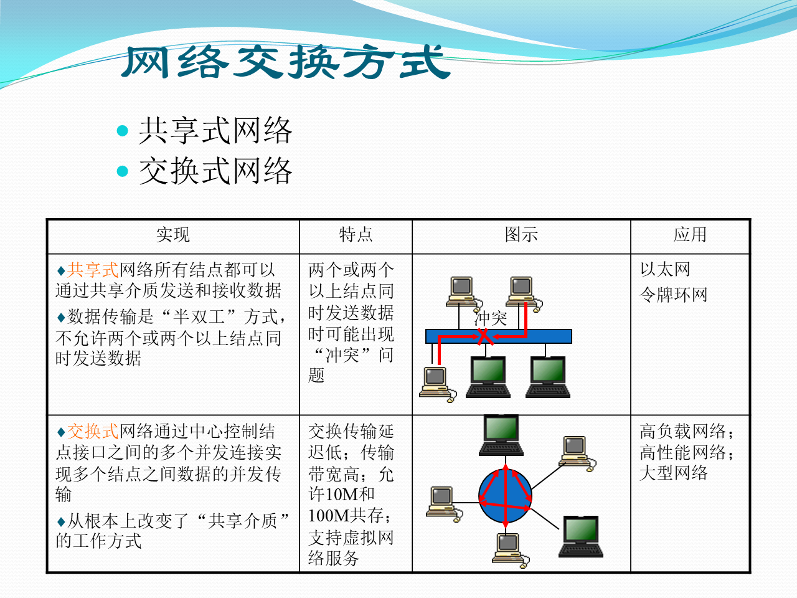


### 数据传输方式，信道


## tcp/ip 概述


**纠错在数据链路层！**


**TCP/IP 协议 属于TCP/IP 协议簇中的传输层
IP 协议 属于TCP/IP 协议 的 网际层**


**运算方法：把IP地址与子网掩码按位与，即得网络地址！**
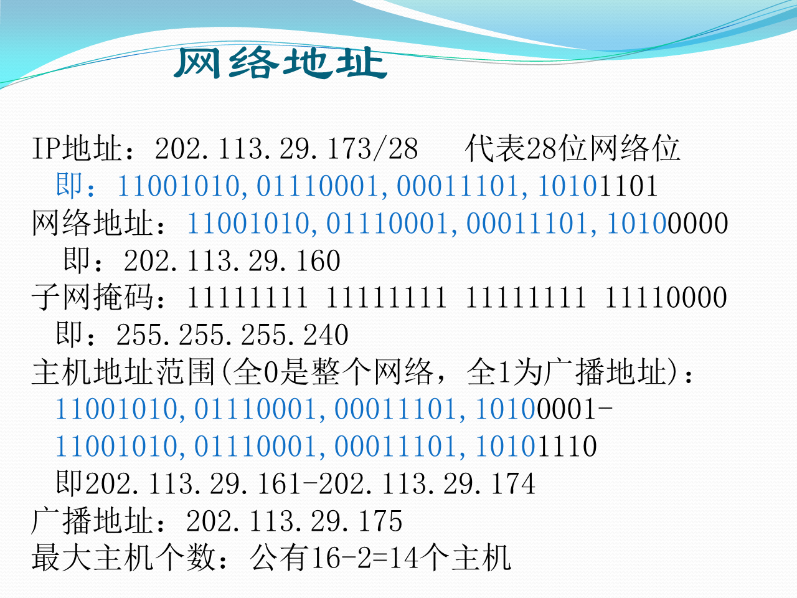
**可用主机地址：可用地址数 - 2（广播、网络地址各一）**


## 作业14 网络基本概念

**波特率指单位时间内载波调制状态变化的次数，或者每秒钟可能发生的信号变化次数**

**仅使用令牌传递的确定性媒体控制方法的拓扑为环型**（见L11）

# 操作系统与网络 L13

## 套接口（socket）概念


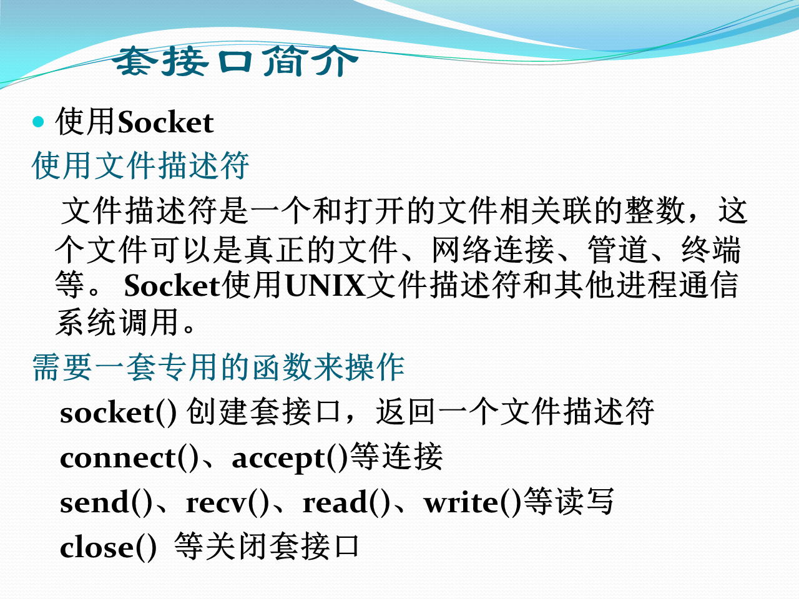

> 黄色框应该指向第一个变量


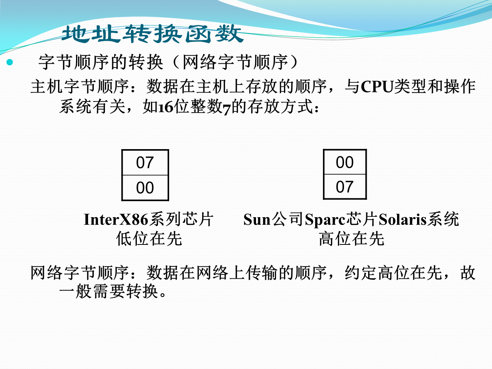


# 操作系统与网络 L14

## 套接口（socket）概念

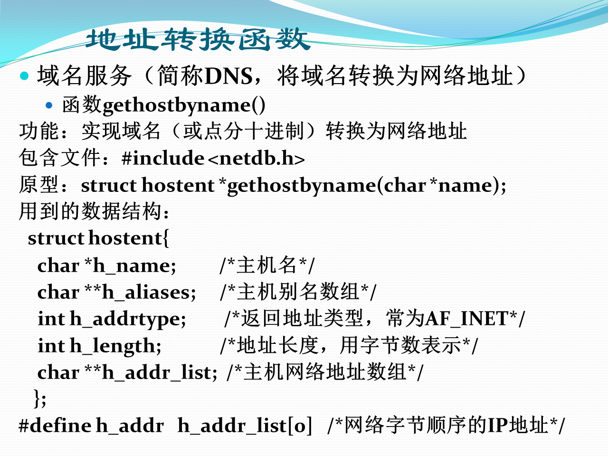

## 面向连接的 socket 编程


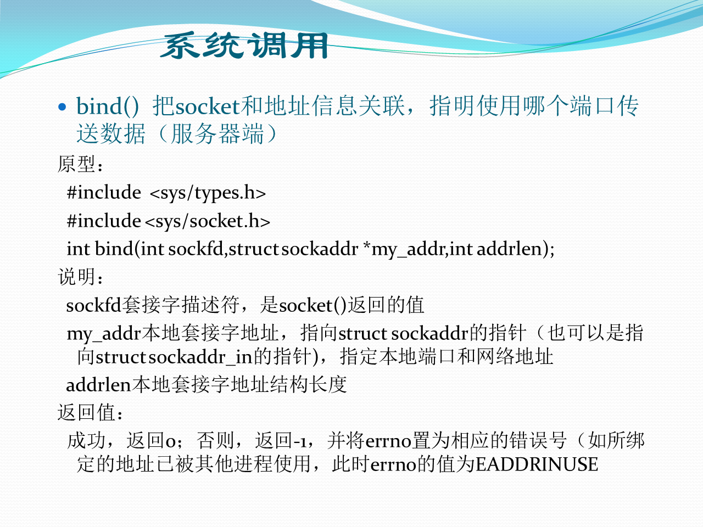


**sockaddr_in 和 sockaddr 的区别：**
参考 [使用bind()和connect()函数](http://c.biancheng.net/cpp/html/3033.html)
# 操作系统与网络 L15

讲解了socket编程例题： `例题.txt`

C++指针用法：`指针用法.docx`


